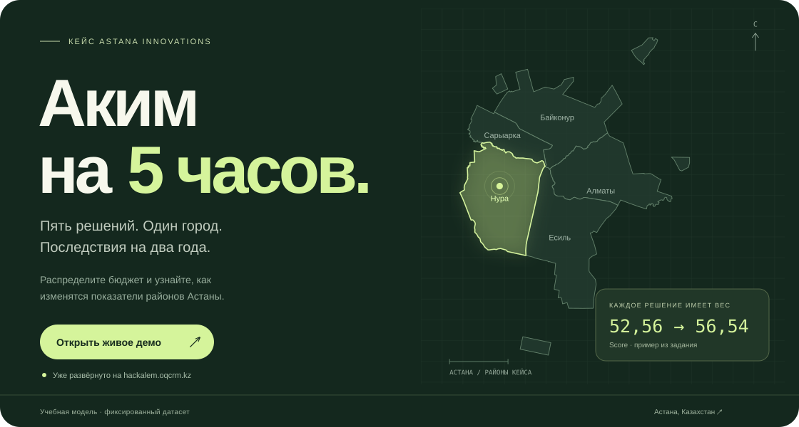

[](https://hackalem.oqcrm.kz)

<p align="center">
  <strong>AI-симулятор управления Астаной · кейс Astana Innovations</strong><br>
  Изучите районы, распределите бюджет и узнайте последствия своих решений.
</p>

<p align="center">
  <a href="https://hackalem.oqcrm.kz"><strong>Открыть живое демо ↗</strong></a>
  &nbsp; · &nbsp;
  <a href="#быстрый-старт">Запустить локально</a>
  &nbsp; · &nbsp;
  <a href="#проверить-результат">Сценарий для жюри</a>
  &nbsp; · &nbsp;
  <a href="docs/TZ.md">Техническое задание</a>
</p>


## Город оживает в ваших решениях

Школа в Нуре, чистое топливо в Сарыарке или цифровые сервисы для всего города?
Ресурсов на всё не хватит. Соберите план, проверьте компромиссы и получите объяснение результата.

https://github.com/user-attachments/assets/c1c7dbb5-a679-4dec-a570-22b67309e630

*25 секунд · 1080p · карта → план → результат. Ролик со звуком.*

**Приложение уже развёрнуто:** [hackalem.oqcrm.kz](https://hackalem.oqcrm.kz).
Можно сразу открыть симулятор в браузере, без локальной установки.

## Управлять — значит выбирать

| 01 · Изучите город | 02 · Соберите план | 03 · Поймите результат |
| --- | --- | --- |
| Интерактивная карта, пять направлений и десять показателей каждого района. Найдите, где изменения нужнее всего. | Выберите ровно пять разных мероприятий и назначьте районы. Проверяются бюджет, лимиты и несовместимости. | Получите Score и изменения показателей. Аналитик объяснит сильные стороны, риски и компромиссы. |

**В рабочей версии:**

- **Карта Астаны:** выбор района, карточка показателей, плавная камера и пять независимых геослоёв.
- **План из 14 мероприятий:** стоимость, лаг и ожидаемые эффекты видны до выбора; не больше двух мер из одного направления.
- **Проверка правил:** бюджет до 100, ровно пять разных решений, обязательные районы и контроль конфликтов.
- **Прозрачный расчёт:** показатели до и после, итоговый Score, критические значения и автоматически применённые синергии.
- **Аналитик:** потоковое объяснение через OpenAI-совместимый API либо воспроизводимый отчёт без ключа.
- **Советник:** точный подбор лучшего допустимого плана, сравнение с вашим сценарием и применение по кнопке.
- **Подсказки:** пять шагов знакомства с интерфейсом по кнопке «Запустить подсказки».

## Математика считает. ИИ объясняет

Все числа вычисляет детерминированный движок. Модель выбирает проверенные факты для объяснения;
текст и числовые значения этих фактов подставляет сервер. Вклад отдельных мер оценивается по Шепли.

```text
Score = 0.7 × D_avg + 0.3 × min(D) − N_crit
```

- **70% веса** — средний результат города с учётом долей населения.
- **30% веса** — самый слабый район: нельзя улучшить один район и забыть об остальных.
- **−1 балл** за каждый показатель района строго ниже 40.

Эффект мероприятия учитывает срок начала действия: `(8 − lag) / 8`.
Синергии добавляются отдельно, а итоговые показатели ограничиваются диапазоном 0–100.
Остаток бюджета не даёт бонуса; порядок решений не влияет на результат.

> Данные организаторов **синтетические**. Это учебная модель, а не актуальная статистика Астаны.
> Исходные значения и формула сохранены без изменений.

[Формула и правила](docs/TZ.md) · [Исходный датасет](docs/dataset.json) · [Подробности расчёта](docs/REFERENCE.md#как-считается-результат)

## Проверить результат

Воспроизводимый сценарий для жюри — соберите эти пять мероприятий:

| Мера | Решение | Где применяется |
| --- | --- | --- |
| M7 | Школа + детсад | Нура |
| M8 | Центр семейного здоровья / поликлиника | Нура |
| M10 | Освещение и камеры | Нура |
| M12 | Единая цифровая платформа обращений | Весь город |
| M5 | Перевод частного сектора на чистое топливо | Сарыарка |

Нажмите **«Рассчитать результат»**, затем **«Объяснить результат»**.

| Итоговый Score | Потрачено | Остаток | Критические показатели |
| :---: | :---: | :---: | :---: |
| **52,56 → 56,54** | **95 / 100** | **5** | **2 → 0** |

Прирост по точным значениям — **+3,99**. В Нуре обеспеченность школами меняется
с 38 до 48, доступность медицины — с 35 до 43,75. Срабатывает синергия M10 + M12.
Без ключа объяснение помечено как шаблонное и строится из рассчитанных данных.

<details>
<summary>Точные значения и полный сценарий проверки</summary>

Исходный Score: `52.55768`. Итоговый: `56.54307`.
`D_avg = 58.0776`, `min(D) = 52.9625`, `N_crit = 0`.
Округление применяется только для отображения.

[Полный чеклист](docs/DEMO.md) включает конфликты, смену района, геослои,
карточки, подсказки, работу клавиатурой и экран шириной 360 px.

</details>

### Проверить советника

1. После расчёта примера выше со Score **56,54** нажмите **«Подобрать лучший план»**.
2. Сравните предложение с текущим планом: **M2 и M14 — весь город; M3, M8 и M9 — Нура**.
   Ожидаемый Score — **57,24** (точно `57.236735`), стоимость — **98**, критических показателей — **0**.
3. Нажмите **«Применить предложенный план»**. Проверьте пять предложенных мер, остаток бюджета **2**
   и пересчитанный Score **57,24**. До нажатия кнопки текущий план сохраняется.

## Быстрый старт

**Без API-ключа и без Docker.** Нужны Git, [uv](https://docs.astral.sh/uv/getting-started/installation/),
[pnpm](https://pnpm.io/installation) и [Node.js](https://nodejs.org/en/download).
Проверено на **Node.js 24**; Vite требует `^20.19.0 || >=22.12.0`.
Python 3.13 и зависимости устанавливаются через `uv` при первом запуске.

Скрипт запускается в Bash на macOS / Linux. На Windows используйте WSL.
Первый запуск требует сети для загрузки зависимостей; порты **8000** и **5173** должны быть свободны.

```bash
git clone https://github.com/BAITC-Hacks/hack-b4eba7e5-team.git
cd hack-b4eba7e5-team
LLM_MOCK=true ./dev.sh
```

| Адрес | Что открывает |
| --- | --- |
| [127.0.0.1:5173](http://127.0.0.1:5173) | Симулятор |
| [127.0.0.1:8000/api/docs](http://127.0.0.1:8000/api/docs) | Swagger API |
| [127.0.0.1:8000/api/health](http://127.0.0.1:8000/api/health) | Состояние бэкенда и режим аналитика |

Для этого режима **файл `.env` не нужен**. Без заданного ключа mock включается автоматически:
расчёт остаётся полноценным, аналитик выдаёт шаблонный отчёт. Остановка — `Ctrl+C`.

### Подключить настоящего ИИ

Из корня репозитория создайте локальный файл настроек:

```bash
cp backend/.env.example backend/.env
```

Откройте **`backend/.env`** и заполните `OPENAI_API_KEY=ваш-ключ`.

| Переменная | Назначение |
| --- | --- |
| `OPENAI_API_KEY` | Ключ выбранного провайдера |
| `OPENAI_MODEL` | Доступная вашему ключу модель |
| `OPENAI_FALLBACK_MODEL` | Запасная модель при временных ошибках |
| `OPENAI_BASE_URL` | Адрес OpenAI-совместимого API; для обычного OpenAI не задаётся |
| `LLM_MOCK` | `true` принудительно включает шаблонный режим даже при наличии ключа |
| `LLM_CACHE` | `true` включает кеш ответов |
| `AI_REQUESTS_PER_MINUTE` | Общий лимит анализа и советника на процесс; по умолчанию 10 |

Выберите доступные вашему провайдеру модели. Убедитесь, что `LLM_MOCK` не включён
в `.env` или окружении, и перезапустите приложение:

```bash
./dev.sh
```

Проверка подключения и доступных моделей:

```bash
cd backend
uv run python -m app.llm_check
```

Ключ хранится **только на бэкенде**. Файл `.env` исключён из Git;
frontend `.env` для запуска не требуется.

<details>
<summary>Если приложение не запускается</summary>

- `uv` или `pnpm` не найдены — установите инструменты по ссылкам выше и откройте новый терминал.
- Vite сообщает об ошибке Node — проверьте `node --version`; используйте поддерживаемую версию, например 24.
- Порт занят — остановите прежний локальный экземпляр и повторите запуск; frontend должен обращаться к тому же backend на 8000.
- Аналитик пишет «Шаблон» после добавления ключа — проверьте `LLM_MOCK` и перезапустите `./dev.sh`.
- Нет подложки карты — внешние тайлы, шрифты и спрайты требуют сети. Выбор района остаётся доступен при отказе WebGL.

</details>

## Под капотом

| Интерфейс | Расчётный движок | Объяснение |
| --- | --- | --- |
| **React 19 + TypeScript** | **FastAPI + Python 3.13** | **OpenAI-совместимый API** |
| Vite · Tailwind CSS v4 · MapLibre GL JS 5 | Pydantic v2 · проверка правил · фиксированный датасет | OpenAI SDK · SSE · кеш · mock-режим |

```text
frontend → /api/sim/evaluate → проверка правил → расчёт → Score и показатели
frontend → /api/sim/analyze  → готовый результат → LLM / mock → объяснение SSE
```

```text
backend/
  app/sim.py                Формулы, типы данных и валидатор
  app/optimizer.py          Точный подбор допустимого плана
  app/analysis.py           Проверенные факты и объяснение
  app/routes/sim.py         Конфигурация, расчёт и анализ
  app/llm.py                Единая обёртка вызовов модели
  .env.example             Шаблон настроек
  tests/                   Тесты без сети и API-ключа
  uv.lock                  Зафиксированные Python-зависимости
frontend/
  src/pages/               Экран симулятора
  src/components/          Карта, каталог и панели
  src/lib/api.ts           Запросы к бэкенду
  public/map/              Локальные геослои
  pnpm-lock.yaml           Зафиксированные frontend-зависимости
docs/                      Задание, датасет и документация
deploy/                    Скрипты выкатки и отката
dev.sh                     Локальный запуск backend + frontend
```

Продакшен работает на **nginx + uvicorn под systemd**. Docker и внешняя база данных для локального запуска не требуются.

[API и эксплуатация](docs/REFERENCE.md) · [Данные карты](docs/MAP_DATA.md) · [Правила разработки](AGENTS.md)

## Проверки

Из корня репозитория после установки зависимостей:

```bash
(cd backend && uv run pytest -q && uv run ruff check app tests && uv run ruff format --check app tests)
(cd frontend && node --test tests/*.test.mjs && pnpm lint && pnpm build)
```

Тесты проверяют формулу, бюджет, несовместимости, синергии, критический порог,
API, потоковое объяснение и геоданные. Настоящий ключ и сеть для тестов не нужны.
После изменений пройдите [сценарий в браузере](docs/DEMO.md).

## Что дальше

В планах — сохранение истории сценариев и агент с инструментами.
**Эти возможности пока не реализованы.**

[Продуктовые задачи](docs/TASKS.md) · [Архитектура](docs/ARCHITECTURE.md)

---

**Какой будет ваша Астана?** [Откройте симулятор и примите пять решений →](https://hackalem.oqcrm.kz)

<sub>HackAlem · кейс Astana Innovations. Карта: © OpenStreetMap contributors / ODbL;
OpenFreeMap / OpenMapTiles. [Источники геоданных](docs/MAP_DATA.md).</sub>
